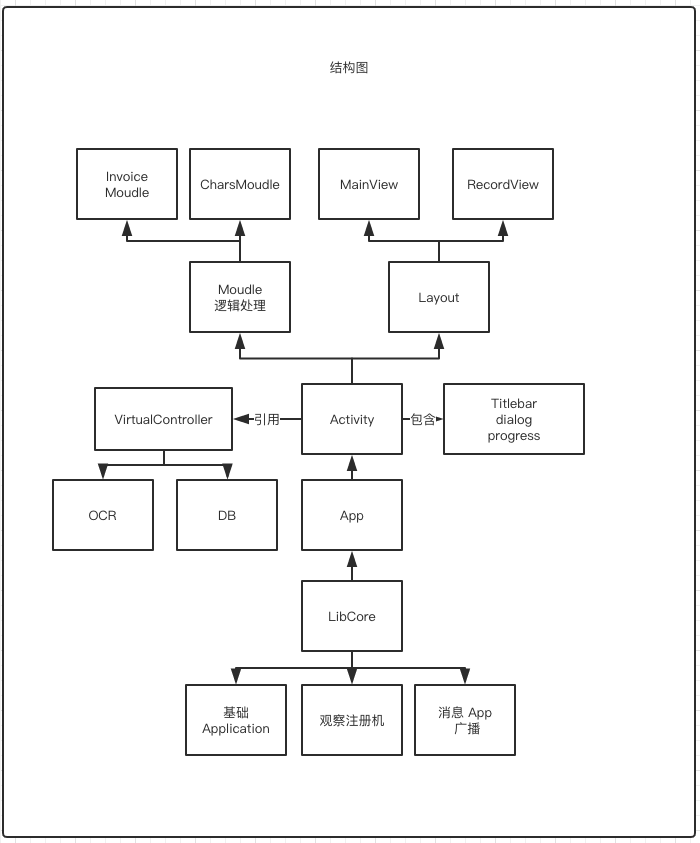
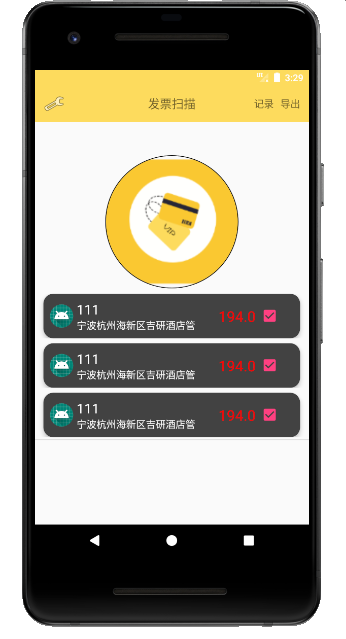
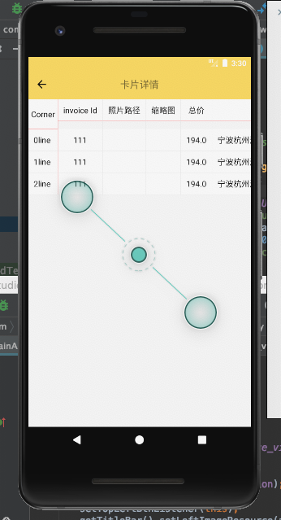
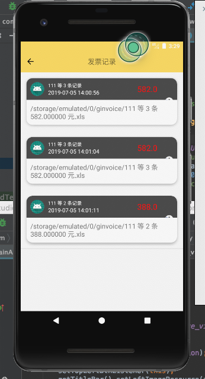

# invoice2 xml 

Android jpg 2 text and photo invoice 2 xml。

百度 ocr 接口实现，也可以用 CNN 算法自己训练文字，然后实现神经元本地计算，详细参考SKLearn 中关于文字识别的相关代码。
主要结构功能图如下：
<p align='center'>
</img>
</p>
虚拟抽离 OCR 和 db 为虚拟设备，父类 Activity 包含了一个 titlebar 并且 create 就会注册到注册机，逻辑模块和业务模块需要在
init 中初始化，每次调用设备时，设定相关 control 的 id 就可以让 libcore 自己去解析 json，把模型数据显示到 view 中，例如
mainActivity 中的模块，可以在 initView 初始化模块：

```
    @Override
    protected void initView () {
        mModel = new CoreMoudle();
        mView = findViewById(R.id.invoice_view);
        mView.setOnClickListener(this);
        setTitle(R.string.str_invoice);
        addRightBtnAction(mRecordingAction);
        setLeftBtnVisable(View.GONE);
        setTopLeftBtnListener(this);
        getTitleBar().setLeftImageResource(android.R.drawable.ic_menu_preferences);
        addRightBtnAction(mAction);
        mView.onFreshModel(mModel);
        mDialog = new AlertDialog.Builder(this);
//        testModel();
        initPermission();
    }

```
    这里设置 view 的布局，这里也可以采用 UIFactory 的方式，加载不同的布局文件，

```
 	@Override
    protected int onCreateViewResID () {
        return R.layout.activity_main;
    }

```
	然后在模块中写入对应的逻辑代码：

```
    @Override
    public void parseParam (LDParam param) {
        super.parseParam(param);
    }

```
    当监听器收到监听动作，就会自己在子线程调用解析方法，在主线程刷新页面：

```
    @Override
    public void onFreshModel (CoreMoudle model) {
        mInvoiceAdapter.setChildItemsLV(model.getInvoices());
    }

```
    百度 OCR 解析的类包括文字模块和 invoice 模块，可以自行集成到第三方 APP 中。

    示例图：    

<p align='center'>
</img>
</img>
</img>

</p>
